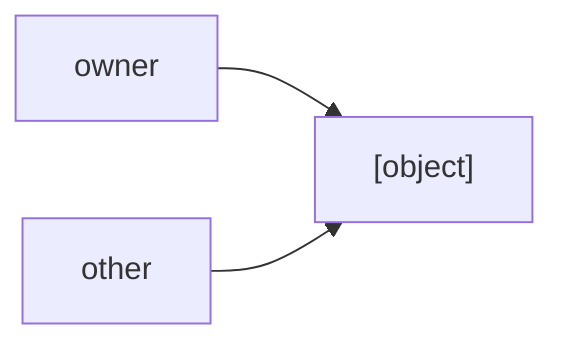

# Appendix G: Memory Model

## Ownership

C^4 uses the term `inval` to describe a pointer or reference that will be freed or otherwise made invalid by some other operation.

### Ownership Rules

- If you create a heap allocation and pass it to a function that expects a stack pointer, **you remain responsible for freeing it**.
- If you create a heap allocation and pass it to a function that expects a heap pointer, check the function's documentation for `inval <pointer>`.
  - If the documentation says the pointer is `inval`, the function takes responsibility for freeing it.
  - Otherwise, you remain responsible for freeing it.
- If a function creates and returns a heap pointer, check its documentation to determine whether the returned allocation is automatically freed.
  - If it is documented as automatically freed, the function is responsible for it.
  - Otherwise, the caller owns the allocation and must free it.
- Passing a pointer by reference does not transfer ownership by itself. Ownership only changes if the function's documentation specifies that the pointer is `inval`.
- Copying or assigning a heap pointer to another pointer does **not** transfer ownership.
```qc
int *a = `malloc(sizeof int);
int *b = a;
```
Here, `a` remains the owner. `b` is simply another pointer to the same allocation.
- Storing a heap pointer inside a struct does not transfer ownership unless explicitly documented. The original owner remains responsible for freeing the allocation.
- If a function returns a heap pointer that it did not create, ownership does not transfer unless the function explicitly documents that it does.
- Passing a pointer by value does not transfer ownership unless the function documents the pointer as `inval`.

### Ownership and `realloc`

`realloc` has special behavior because it may move an allocation to a different location.
The allocation remains owned by the caller. If `realloc` succeeds, the returned pointer becomes the pointer that should be used to access the allocation, and the old pointer is `inval`.
```qc
int *p = `malloc(sizeof int);
p = `realloc(p, sizeof int * 10);
```
After a successful `realloc`, `p` is the valid pointer to the allocation. The old pointer must no longer be used.

### Multiple Pointers

Multiple pointers can refer to the same heap allocation:


Using one of those pointers or references after the allocation has been freed is a use-after-free and results in undefined behavior.

### References and Ownership

Creating a reference to an object does not transfer ownership.
```qc
int *p = `malloc(sizeof int);
int& ref = *p;
```
`p` remains the owner of the allocation. `ref` merely provides another way to access the same object.
If `p` frees the allocation, `ref` becomes invalid as well.
Ownership and references are therefore separate concepts:
- A reference determines how an object is accessed.
- Ownership determines who is responsible for the object's lifetime.

---

If you want inval to not need users to read a comment, use [Owned::Owned](./chapter_34_stdref.md#owned)

## Atomics

`atomic` is a parse-time type helper. It does nothing in the compiled code. Instead, atomics are something you achive using the atomic helpers. See [Appendix C](./appendix_c.md)
