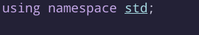
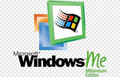

# Introduction

It's a book.

## Who's C^4 for?

People like me. People who want speed, control, power, and a language that doesn't have 5 new arguments every hour and a new failed successor every 15 minutes.
C^4 strives for clean code, no bad practices, readable syntax, and not saying "Uhhhh its not a zero-cost so... you must hate me and my entire bloodline".

## Who's this book for?

Anybody who wants to learn the what, how, and why of C^4.

## How to use this book:

Just read it. It's preferred to code along, and you will be prompted to along the way, but just reading it is good enough.

Gonna steal this one straight from the rust book:

These will be put next to code to show if they are meant to show something other than "good" code:

| Logo | Meaning |
| ---- | ------- |
|  | Code does not compile |
|  | This code is heavily discouraged |
|  | This code errors/crashes |
|  | This code does not produce the expected output. |

## Sections

This book will be split into 4 sections.

1. How use the language
2. How does the language 
3. How make stuff for the language
4. How use stuff made for the language.

Any large code block will probably be heavily commented, and should be read (especially in section 2)

---

By the end of this book, you will have learned how to use C^4, how it works, how it compiles to LLVM, and how to make libraries for it. You'll build 3 big projects along the way, and, eventually, learn how the computer putes.
