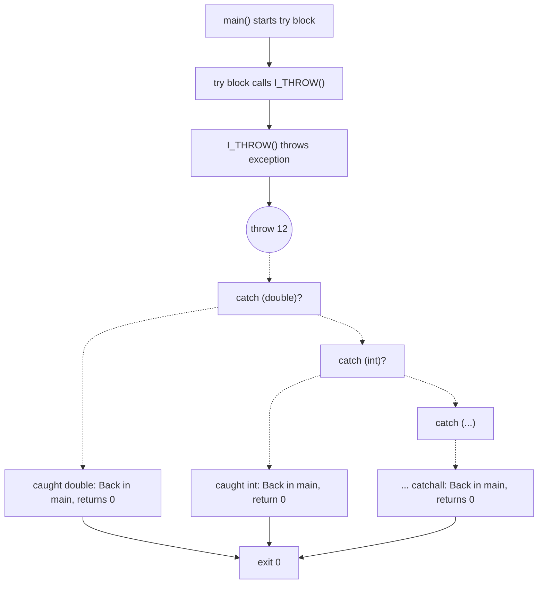

# Try Catch Internals

Try Catch is... complex. Basically, when you create a trycatch block, it creates a "landing pad", the catch block, which is then set in the compiler and jumped to if a error is thrown. That catch block then checks if the types are searched for in this block and if not continues the unwind.
Functions that can throw are called with `invoke` instead of `call`, and `invoke` takes where the landing pad to jump to is. The `throw` instruction tells the compiler to raise an exception.

This code:
```qc
void I_THROW() {
    throw 12;
}
int main() {
    try {
        I_THROW();
    } catch (double d) {
    } catch (int i) {
    } catch (...) {
    }
    return 0;
}
```
Becomes this ugly LLVM.
```llvm
target datalayout = "e-m:e-p270:32:32-p271:32:32-p272:64:64-i64:64-i128:128-f80:128-n8:16:32:64-S128" ; datalayout of CPU. doesn't need to be understood
target triple = "x86_64-pc-linux-gnu" ; compiling to x86_64 linux gnu ASM.
@.str.43 = private unnamed_addr constant [24 x i8] c"Uncaught exception: %s\0A\00", align 1
@.qc.str = private constant [4 x i8] c"int\00"
@.qc.str.1 = private constant [7 x i8] c"double\00"
@.qc.str.2 = private constant [4 x i8] c"int\00"
@switch.table.__qc_personality = private unnamed_addr constant [13 x i64] [i64 8, i64 poison, i64 2, i64 4, i64 8, i64 poison, i64 poison, i64 poison, i64 poison, i64 poison, i64 2, i64 4, i64 8], align 8
; Function Attrs: mustprogress noinline nounwind optnone uwtable
define internal fastcc ptr @__qc_create_exception(ptr noundef nonnull %0) unnamed_addr #5 {
    ; creates unwing exception
}
; Function Attrs: mustprogress noinline optnone uwtable
define internal fastcc void @__qc_throw(ptr noundef %0) unnamed_addr #6 {
    ; creates exception and starts stack unwind
}
; Function Attrs: mustprogress noinline optnone uwtable
define internal range(i32 3, 9) i32 @__qc_personality(i32 noundef %0, i32 noundef %1, i64 noundef %2, ptr noundef %3, ptr noundef %4) #6 {
    ; This is the big thing. This is what does the actual unwinding. It's what is called by landing pads.
}
; ============== CODE =====================
; Function Attrs: noreturn
define void @I_THROW() !qc.return_types !21 {
entry:
  %0 = alloca i32, align 4
  store i32 12, ptr %0, align 4
  %exception = call ptr @__qc_create_exception(ptr @.qc.str, ptr %0)
  call void @__qc_throw(ptr %exception)
  unreachable ; unreachable because when code throws the rest of the function cannot happen.
} ; as you can see, creates an exception and throws it.
define i32 @main() personality ptr @__qc_personality !qc.return_types !22 { ; the personality keyword marks the functions personality as the __qc_personality function
entry:
  %i = alloca i32, align 4 ; alloca for if a int is caught
  %d = alloca double, align 8 ; alloca for if a double is caught
  br label %try.start ; starts the try block
try.start:                                        ; preds = %entry
  invoke void @I_THROW() ; invoke instead of call.
          to label %invoke.cont.0 unwind label %catch.landing ; continue break point is invoke.cont.0, on unwind is catch.landing (the landing pad)

catch.landing:                                    ; preds = %try.start
  %qc.exception = landingpad { ptr, i32 } ; landing declareator. The strings are for the types. @.qc.str.1 is "double" (first), and .2 is "int" (second), and null is the ... (catchall)
          catch ptr @.qc.str.1
          catch ptr @.qc.str.2
          catch ptr null
  %exception = extractvalue { ptr, i32 } %qc.exception, 0 ; extracts the exception
  %selector = extractvalue { ptr, i32 } %qc.exception, 1 ; extracts the exception selector type. We get this all from the personality function (important)
  switch i32 %selector, label %catch.no_match [ ; defaults to no match
    i32 1, label %catch.0 ; catch block 0 (double)
    i32 2, label %catch.1 ; catch block 1 (int)
    i32 3, label %catch.2 ; catch block 2 (...)
  ]
try.end:                                          ; returns if no error
  ret i32 0
catch.0:                                          ; preds = %catch.landing
  %exception.value.ptr = getelementptr inbounds nuw { ptr, i32 }, ptr %exception, i32 0, i32 1 ; first catch: gets the value and stores it into the %d we allocated earlier, jumps to the end
  %exception.value = load ptr, ptr %exception.value.ptr, align 8
  %caught.value = load double, ptr %exception.value, align 8
  call void @llvm.memset.p0.i64(ptr align 8 %d, i8 0, i64 8, i1 false)
  store double %caught.value, ptr %d, align 8
  br label %try.end

catch.1:                                          ; preds = %catch.landing
  %exception.value.ptr1 = getelementptr inbounds nuw { ptr, i32 }, ptr %exception, i32 0, i32 1 ; second catch: gets the value and stores it into the %i from earlier
  %exception.value2 = load ptr, ptr %exception.value.ptr1, align 8
  %caught.value3 = load i32, ptr %exception.value2, align 4
  call void @llvm.memset.p0.i64(ptr align 4 %i, i8 0, i64 4, i1 false)
  store i32 %caught.value3, ptr %i, align 4
  br label %try.end

catch.2:                                          ; no store/load because you can't get a untyped value.
  br label %try.end

invoke.cont.0:                                    ; no error
  br label %try.end

catch.no_match:                                   ; no match: continue the personality unwind.
  resume { ptr, i32 } %qc.exception
}
```
I explained as best as I could. (Read the heavily commented LLVM).

Here's a graph for what happens.


<details>
    <summary> </summary>
<details>
<details>
<details>
<details>
<details>
<details>
<details>
<details>
<details>
<details>
<details>
<details>
<details>
<details>
<details>
<details>
<details>
<details>
<details>
<details>
<details>
<details>
<details>
<details>
<details>
<details>
    <summary>Why are you still clicking</summary>
<details>
<details>
<details>
<details>
<details>
<details>
<details>
    <summary>My Secret</summary>
    <p>I banned nested try catch <i>because it was too hard to make, and didn't give me a reason to make it. Yay!</i></p>
</details>
</details>
</details>
</details>
</details>
</details>
</details>
</details>
</details>
</details>
</details>
</details>
</details>
</details>
</details>
</details>
</details>
</details>
</details>
</details>
</details>
</details>
</details>
</details>
</details>
</details>
</details>
</details>
</details>
</details>
</details>
</details>
</details>
</details>
