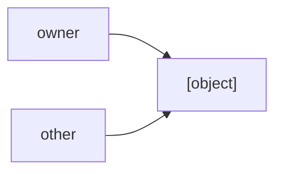

# Memory

Your programs need somewhere to put their data.
When you create a variable, allocate an object, or call a function, your program needs memory to store the information it is working with.
Memory is just a large collection of bytes. Each byte has an address, which is a number that identifies where that byte is located.
For example, imagine memory looking like this:

```text
Address Value
0x1000  42
0x1001  17
0x1002  00
0x1003  FF
...
```

The exact addresses and values here are arbitrary. The important part is that memory has **addresses** and values.
There are two important areas of memory we'll talk about: the **stack** and the **heap**.

## The Stack

The stack is memory used for temporary data.
For example:

```qc
int add(int x, int y) {
    int result = x + y;
    return result;
}
```

When `add` is called, the program needs somewhere to keep things such as its local variables and information about the function call.
The stack is split into **stack frames**. When a function is called, a new stack frame is pushed onto the stack.

Theoretically, your stack could look like:

```text
Stack
|---------------------|
| add's data          |
|---------------------|
| main's data         |
|---------------------|
```

When `add` returns, its stack frame is destroyed.
The stack is where almost all of your data will be.

## The Heap

The heap is used for dynamically allocated memory.
Unlike the stack, memory on the heap lives until the end of the program unless explicitly freed.

```text
Stack                  Heap
|--------------|       |--------------|
| local data   |       | allocated    |
|              |       | objects      |
|--------------|       |--------------|
```

The heap is useful when you need memory whose lifetime is not naturally tied to a particular function call.
In C^4, the heap is manually allocated.

## Lvalues and Rvalues

These are simple. lvalues are expressions that identify an object in memory, and therefore can have an address. rvalues are expressions that produce a value without identifying an object in memory.
An example of a lvalue could be a variable access, a field access on a struct, or a pointer dereference (explained later).
An example of a rvalue could be an addition, a function call, or a literal.

The left hand sides of assignments must be lvalues.

## Pointers

A pointer is a value that contains a memory address.
Suppose we have:

```qc
int x = 42;
```

`x` might be stored at address `0x1000`:

```text
Address     Value
0x0992      <empty>
0x0996      <empty>
0x1000      42
0x1004      <empty>
0x1008      <empty>
```

In that case, a pointer to `x` would contain `0x1000`.

```text
x:
0x1000: 42

pointer:
0x1000
```

The pointer does not contain `42`. It contains the **address where `42` is stored**.
This lets us refer to data indirectly.

Pointer types are the pointee type (the type the pointer points to) with a * at the end.
```qc
int *x; // pointer to an int.
int* *y; // pointer-to-a-pointer to an int
int** *x; // pointer-to-a-pointer-to-a-pointer to an int
```
To get a pointer to (a.k.a the address of) something, you use the `&`(address-of) operator.

```qc
int x = 0;

int *p = &x;
```

You can only take the address of a lvalue (it's literally in the definition of lvalue and rvalue).
Pointers also have a sentinel (value that has specific meaning) value, `nullptr`. It is literally a pointer to nothing. A null pointer.

## Dereferencing

If you have a pointer, you can use it to access the value at the address it contains. This is called **dereferencing**.
So if a pointer points to an integer containing `42`, dereferencing that pointer gives you the integer `42`.
Pointers are useful because they allow multiple pieces of code to refer to the same data without copying the data itself.
For example, instead of passing an enormous object to a function by copying the entire object, you can pass a pointer to it.
Normally functions are pass-by-value, meaning the value is copied when the function is called.

```qc
int add (int a, int b) {
    a += b;
}
int main() {
    int x = 0;
    add(x, 2); // x is still 0 
}
```

Pointers allow you to pass the actual memory address and thus directly mutate the actual object.

To dereference a pointer you use the `*` unary operator (not to be confused with the `*` (multiplication) binop)

```qc
int add(int *x, int y) {
    *x += y;
}
int main() {
    int x = 0;
    add(&x, 12); // x is now 12
}
```
You may think you need to constantly type `(*mystruct).thing`, and you do, except we have a fancy shorthand for it: `->`.
```qc
mystruct->thing;
```

## Stack vs. Heap

A lot of people say the important distinction is that one is "fast" and one is "slow." Those people are wrong and probably type `using namespace std;` in C++. The important distinction is **how their memory is managed and how long the data needs to live**.
The stack is generally used for data associated with function calls:

```qc
int calculate() {
    int x = 10;
    int y = 20;
    return x + y;
}
```

`x` and `y` are local to `calculate`, so their lifetime naturally fits the function call.
The heap is useful when data needs a lifetime that isn't tied directly to the current function:
```text
function starts
       |
       V
allocate object
       |
       V
use object
       |
       V
function ends
       |
       | object may still exist
       V
continue using object
       |
       V
object is eventually deallocated
```

## Void Pointer

`void *` is a special type that can store a pointer to ANYTHING.

## Pointer Arithmetic

You can perform addition & subtraction on pointers.

- `pointer + wholenumbertype`: Gives the pointer to the pointers address + the right hand side * the element type size.
        int *p = 0x1000
        sizeof(int) = 4
        p + 1 = 0x1004
        p + 2 = 0x1008
        p + 3 = 0x100C
- `pointer - pointer`: Gives `[address of pointer 1 - address of pointer 2] / sizeof element type`
- `pointer - int`: Same as pointer + number but - instead of +.

## Arrays

Arrays are an ordered collection of data. Array types end in `[]`.
Array can be initialized with "array literals", which are values wrapped in `[]`.

```qc
int[] x = [1, 2, 3];
```

You can also make empty array literals by instead making the first element the type and elem 2 the number of copies of the empty value.
```qc
[int, 20] // an empty array of 20 ints
```

Arrays can be "decayed" to pointers, meaning they are converted to pointers. This works by making the actual pointer point to the first element of the array, then the pointer at `<pointeraddress> + 1` at the second, and so on and so forth.
Arrays can also be indexed. This gives you the Nth element.
```qc
x[0]; // first element
```
0 gives you the first element because indexing `x[N]` is equivalent to:
```qc
*(x + N)
```
And because arrays first element is stored at the address of the array, you need to get the address of the array, which is `x + 0`

Strings are actually pointers to an array of chars!

string == char* == char[]

The type of " " is `char *`.
This means you can index strings.

You can get the length of strings for a reason. String literals actually have a bonus character: The null terminator (`\0`). 
`"Hello, World"` is actually `['H', 'e', 'l', 'l', 'o', ',', ' ', 'W', 'o', 'r', 'l', 'd', '\0']`

## Memory Integers

There are 3 additional integer types:

- `addr_t`: A pointer-sized unsigned integer. (So on a 64-bit system `addr_t` is a 64-bit unsigned (can't be negative) int)
- `byte`: A unsigned int the size of 1 byte. `char` is actually the signed version of this type (kinda).
- `nibble`: A unsigned int the size of a nibble (4 bits).

## Non Decimal Literals

You can use non-base10 literals. Specifically hex (base16), octal (base8) and binary (base2).

To type a hex literal, you prefix your number with 0x, 0o for octal, and 0b for binary.

(If you don't know, base 10 is 0-9, base 16 is 0-f (so each digit is 0-15), base 8 is 0-7, and binary is 0-1, and binary scales where each digit is a new power of 2)
Normally, these integers default to type `addr_t` and normal decimal defaults to `int`. You must manually change literals types:

- Add `s` to the end of a literal to make it a short
- Add `i` to the end of one of the non-base10 literals to make it a integer
- Add `a` to the end of a base10 literal to make it a addr_t
- Add `l` to the end of a literal to make it a `long int`
- Add `y` to the end of a literal to make it a `byte`
- Add `n` to the end of a literal to make it a `nibble`

## Heap Allocation 

To get the size of a type, you use the `sizeof` operator.

```qc
addr_t x = sizeof int; // if you are on any standard platform, int is 32 bits (4 bytes) so x is 4
```

If you want to multiply the size of something, you need to wrap sizeof in () or else it will think you are trying to get the size of a pointer.

To allocate memory on the heap, you use the `` `malloc `` intrinsic. It allocates memory on the heap. It takes one argument (an addr_t), the size (in bytes) you want to allocate, and returns a pointer to that many bytes on the heap.

```qc
int *x = `malloc(sizeof int);
```

To free it you use the `` `free `` intrinsic, which frees the memory. It takes the pointer and frees it.

## Memory Intrinsics

| Intrinsic         | Arg Types | Ret Type | Use |
| ----------------- | --------- | -------- | --- |
| `` `mapped_ptr `` | addr_t    | void *   | Get a pointer to a specific memory address |
| `` `to_address `` | void *    | addr_t   | Get the address of a pointer               |
| `` `realloc ``    | void *, addr_t | void * | Reallocates an existing pointer (arg1) to a new size (arg2), while preserving the original data |
| `` `calloc ``     | addr_t, addr_t | void * | Allocates arg2 number of arg1 size set to 0. |

## Memory Safety

Great power comes with great responsibilities
> Me, maybe

A pointer can point to valid memory:

```text
pointer ------> valid object
```
But it can also point somewhere it shouldn't:
```text
pointer ------> invalid memory
```
Trying to access invalid memory can cause a crash or, worse, cause your program to corrupt other data.
There are a handfull of memory errors involving pointers:
- **Dereferencing null pointers:** dereferncing nullptr
- **Dangling pointers:** a pointer refers to memory that is no longer valid.
- **Out-of-bounds access:** code accesses memory outside an object's valid range.
- **Use-after-free:** code accesses heap memory after it has been released.
- **Memory leaks:** allocated memory is never released when it is no longer needed.

These are some of the reasons memory management is one of the most important parts of systems programming.
Here are some things that happen if you do something bad with memory:
- Dereferencing a `nullptr`: UB. 99% of the time is a `Segmentation Fault` (segfault)., which is a specific error that basically says "Hey stupid. You did something illegal with memory that made the OS fail to _segment_ the memory. We won't tell you where though.
- Dereferencing a Dangling Pointer: UB. Once again, probably a segfault (get used to this word).
- Dereferencing an Out-of-bounds Pointer: Guess.
- Use-After-Free: Guess.
- Memory Leaks: No actual crash, but instead can cause your program to crash later down the line if you need memory and have leaked it all.

Examples of each of the above:
```qc
int *dangle() {
    int p = 0;
    return &p; // dangling pointer
}
int main() {
    int *p = nullptr;
    *p; // dereferenced a nullptr.
    *dangle(); // dereferenced a dangling pointer.
    int x = 0;
    p = &x;
    p[2]; // outside of bounds of p. Could segfault.
    p = `malloc(sizeof int);
    `free(p);
    *p; // p is used out after free.
    p = `malloc(sizeof int);
    // p is leaked
}
```

## References

Sometimes we want to pass or access an existing object without explicitly dealing with a pointer. **References** do this.
A reference is an alias for an existing lvalue. Internally, a reference is just a pointer that is automatically dereferenced whenever it is used.
```qc
int x = 10;
int& y = x;
y = 12;
```
After this, `x` is `12`. `y` is not a separate object containing a copy of `x`; it refers to the same object.
References cannot be reassigned. Once a reference has been initialized, it always refers to the object it was initialized with.
```qc
int x = 10;
int y = 20;
int& ref = x;
ref = y;
```
This does not make `ref` refer to `y`. Instead, it assigns the value of `y` to the object that `ref` refers to. `x` is now `20`, while `ref` still refers to `x`.
References cannot be made to other references.

### References as Function Parameters

References can be used as function parameters. This allows a function to directly modify the object passed to it without requiring the caller pass a pointer.
```qc
void addTo(int& lhs, int rhs) {
    lhs += rhs;
}
int x = 12;
addTo(x, 21);
```
After the call, `x` is `33`.

### Returning References

References can also be returned from functions, but this should only be done when the referenced object will remain alive after the function returns.
For example, a function could return a reference to an element of an array whose lifetime extends beyond the function call.
However, returning a reference to a local variable is invalid:

```qc
int& doStuff() {
    int x = 12;
    return x;
}
```

`x` is a local stack variable. Its lifetime ends when `doStuff` returns, so the returned reference refers to an object that no longer exists.
Using the returned reference therefore causes UB. This is the same fundamental problem as a dangling pointer: **the reference outlives the object it refers to**.
References are therefore another way to access existing objects, not a way to extend their lifetimes.

References can be null - as they are pointers - but it is not reccomended

## Ownership

Pointers give us direct control over heap memory, but they also create an important question:
> Who can we `git blame` for a memory leak.

This responsibility is called **ownership**.
In C^4, ownership is essentially the answer to the question **“Who frees what?”**
A pointer that owns a heap allocation is responsible for eventually freeing that allocation. Other pointers may refer to the same allocation without owning it.
C^4 uses the term `inval` to describe a pointer or reference that will be freed or otherwise made invalid by some other operation.

### Ownership Rules

There are several rules that determine ownership.

- If you create a heap allocation and pass it to a function that expects a stack pointer, **you remain responsible for freeing it**.
- If you create a heap allocation and pass it to a function that expects a heap pointer, check the function's documentation for `inval <pointer>`.
  - If the documentation says the pointer is `inval`, the function takes responsibility for freeing it.
  - Otherwise, you remain responsible for freeing it.
- If a function creates and returns a heap pointer, check its documentation to determine whether the returned allocation is automatically freed.
  - If it is documented as automatically freed, the function is responsible for it.
  - Otherwise, the caller owns the allocation and must free it.
- Passing a pointer by reference does not transfer ownership by itself. Ownership only changes if the function's documentation specifies that the pointer is `inval`.
- Copying or assigning a heap pointer to another pointer does **not** transfer ownership.
```qc
int *a = `malloc(sizeof int);
int *b = a;
```
Here, `a` remains the owner. `b` is simply another pointer to the same allocation.
- Storing a heap pointer inside a struct does not transfer ownership unless explicitly documented. The original owner remains responsible for freeing the allocation.
- If a function returns a heap pointer that it did not create, ownership does not transfer unless the function explicitly documents that it does.
- Passing a pointer by value does not transfer ownership unless the function documents the pointer as `inval`.

### Ownership and `realloc`

`realloc` has special behavior because it may move an allocation to a different location.
The allocation remains owned by the caller. If `realloc` succeeds, the returned pointer becomes the pointer that should be used to access the allocation, and the old pointer is `inval`.
```qc
int *p = `malloc(sizeof int);
p = `realloc(p, sizeof int * 10);
```
After a successful `realloc`, `p` is the valid pointer to the allocation. The old pointer must no longer be used.

### Multiple Pointers

Multiple pointers can refer to the same heap allocation:


Using one of those pointers or references after the allocation has been freed is a use-after-free and results in undefined behavior.

### References and Ownership

Creating a reference to an object does not transfer ownership.
```qc
int *p = `malloc(sizeof int);
int& ref = *p;
```
`p` remains the owner of the allocation. `ref` merely provides another way to access the same object.
If `p` frees the allocation, `ref` becomes invalid as well.
Ownership and references are therefore separate concepts:
- A reference determines how an object is accessed.
- Ownership determines who is responsible for the object's lifetime.

In english: a program can have many pointers and references to an object, but there should be a singular clear owner, and we shouldn't need to deal with "You are NOT the allocater"

## Bitwise Operations

Finally, there are bitwise operations. These operate directly on the bits of a number, but first we must understand how binary works.

Binary numbers only contain the digits 1 and 0. Each position in a binary number represents a different power of 2, just like each position in a base-10 number represents a different power of 10.

Base 10:
```text
  1   1   3
  V   V   V
100  10   1
```
The places represent powers of 10:
```text
10²   10¹   10⁰
100    10    1
```
So we multiply each digit by the value of its position and add them together:
```text
1 * 100 + 1 * 10 + 3 * 1
= 100 + 10 + 3
= 113
```
Binary works the same way, except the positions are powers of 2:
```text
  1   1   1
  V   V   V
  4   2   1
```
These are:
```text
2²   2¹   2⁰
4    2    1
```
So:
```text
1 * 4 + 1 * 2 + 1 * 1
= 4 + 2 + 1
= 7
```
The difference is that base 10 uses powers of 10, while binary uses powers of 2. The same applys with hexadecimal and 16 and octal and 8
For example, `1011` in binary means:
```text
  1   0   1   1
  8   4   2   1
= 1 * 8 + 0 * 4 + 1 * 2 + 1 * 1
= 8 + 0 + 2 + 1
= 11
```
So `1011` in binary is 11 in base 10.
You may wonder how we represent negative numbers in binary, since everything we've seen so far has been positive. It's actually pretty simple.
One common way to represent signed (positive and negative) integers is called two's complement. In two's complement, the most significant bit (the leftmost bit) has a negative value, while the other bits have their usual (positive) values.
For example, 100101 represents -27:
```
  1    0   0   1   0   1
-32   16   8   4   2   1
= -32 + 4 + 1
= -27
```
The leftmost 1 represents -32 instead of +32, which makes the entire number negative.
This is called two's complement, and it allows computers to represent both positive and negative integers using the same binary bits.
This is why an `int`'s minimum value has an absolute value that is one more than its maximum value. To wrap your head around this, consider an 8-bit signed integer.
There are 256 possible combinations of 8 bits:
```text
2⁸ = 256
```
In two's complement, half of these combinations represent negative numbers, while the other half represent non-negative numbers. That gives us 128 combinations for positive and 128 for negative:
However, 0 is included in the non-negative values, leaving only 127 positive values.
Therefore, the range is:
```text
-128 ... -2  -1   0   1   2 ... 127
```
The smallest value is `-128`, represented as:
```text
10000000
```
And the largest value is `127`, represented as:
```text
01111111
```
So an 8-bit signed integer has a range of -128 to 127.
This is why the minimum value's absolute value is one greater than the maximum value:
```text
|-128| = 128
| 127| = 127
```

Now time for the actual bitwise stuff.
### Bitwise Logic

Bitwise logic performs a logical operation on every bit of a number.
- `|`: Bitwise OR:
    OR's every bit
    `0110 | 1000` = `1110`;
- `&`: Bitwise AND:
    AND's every bit
    `0110 & 1000` = `0000`;
    `0101 & 1011` = `0001`;
- `$`: Bitwise XOR:
    XOR's every bit
    `0110 $ 1000` = `1110`;
    `0101 $ 1011` = `1110`;
- `~`: Bitwise NOT:
    NOT's every bit
    `~1010` = `0101`

### Shifts

Shifts directly move around bits on numbers.

Shifts precedancy sits between multiplication & division and plus & minus

- `<<`:
    Left shift. Directly shifts the bits of a number left RIGHT_OPERAND times.
    Signed:
    ```
    1001 << 0001 = 0010
    -7       1      2
    0111 << 0010 = 1100
    7       2      -4
    ```
    Unsigned:
    ```
    0101 << 0001 = 1010
    5       1      10
    ```
    Left shift in normal math is just
    `left * 2 ^ right`
- `|>`:
    Arithmetic right shift. Shifts bits of a number right RIGHT_OPERAND times, while preserving the sign bit to keep numbers negative
    Signed:
    ```
    1001 |> 0001 = 1100
    -7      1      -4
    0110 |> 0010 = 0001
    6       2      1
    ```
    Unsigned:
    ```
    1101 |> 0001 = 1110
    13      1      14
    ```
    This is not good behavior for right shift on unsigned numbers, which is why we have logical right shift. (most of the time)
    
    In normal math:
    `left / 2 ^ right`
- `:>`:
    Logical right shift. Directly shifts numbers right RIGHT_OPERAND times
    Signed:
    ```
    1001 :> 0001 = 0100
    -7      1      4
    0110 :> 0010 = 0001
    6       2      1
    ```
    Unsigned:
    ```
    1101 :> 0001 = 0110
    13      1      6
    ```
    This behavior is ideal for unsigned numbers but not for signed. (most of the time)

    In normal math:
    `floor(left/2^right)`
- `<<<`:
    Left rotation. Like left shift, but bits that fall off wrap around.
    Signed:
    ```
    1001 <<< 0001 = 0011
    -7       1      4
    0110 <<< 0010 = 1001
    6        2      -7
    ```
    Unsigned:
    ```
    1101 <<< 0001 = 1011
    13       1      11
    ```
    
    In normal math:
    With b as the system bitwidth
    `((x * 2^(n mod b)) mod (2^b)) + floor(x / (2^(b - (n mod b))))`
- `|>>`:
    Right rotation. Like logical right shift, but bits that fall off wrap around.
    Signed:
    ```
    1001 |>> 0001 = 1100
    -7       1      -4
    0110 |>> 0010 = 1001
    6        2      -7
    ```
    Unsigned:
    ```
    1101 |>> 0001 = 1110
    13       1      14
    ```

    In normal math:
    With b as the system bitwidth
    `floor(x / (2^(n mod b))) + ((x * 2^(b - (n mod b))) mod (2^b)`

Shifts and bitwise logic also have combinational versions.

## Quiz

{{#quiz ../quizzes/memory.toml}}
